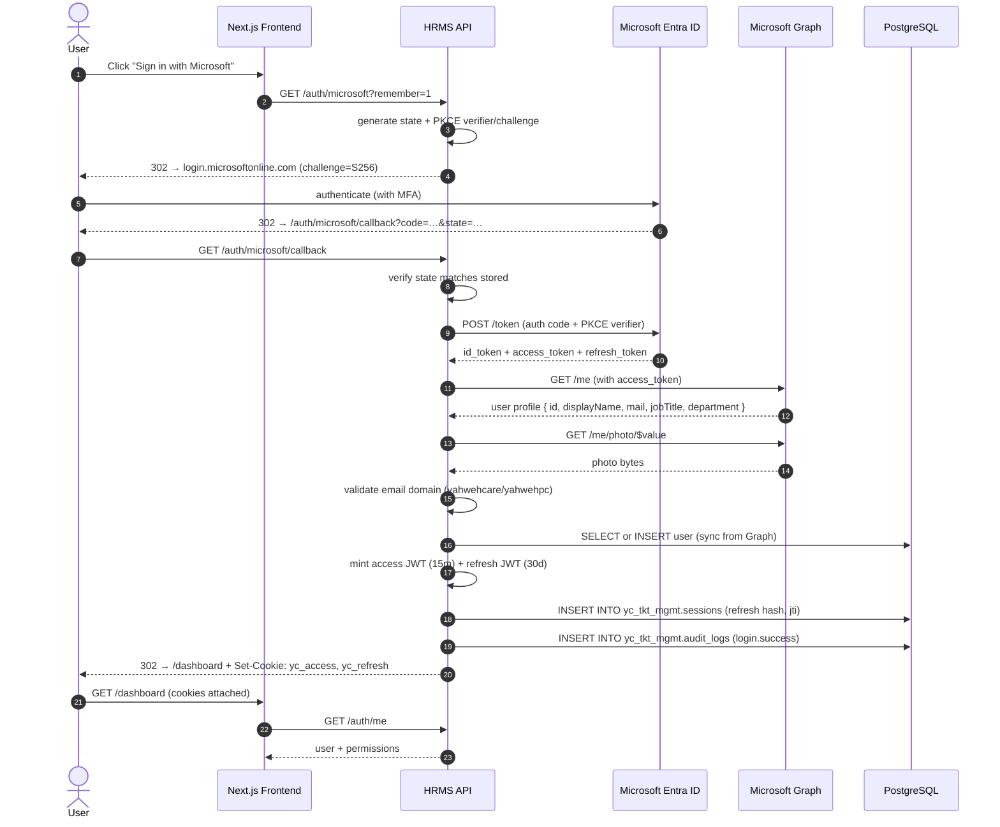
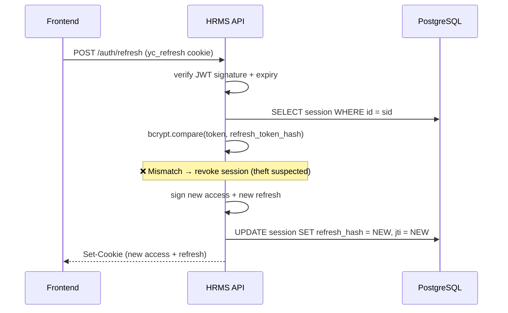

# Architecture

## 1. High-level system

```
                    ┌──────────────────────────────────────────┐
                    │           Microsoft Entra ID             │
                    │  (Identity Provider — OAuth 2.0 / OIDC)  │
                    └──────────────────┬───────────────────────┘
                                       │ SSO + Graph API
                                       │
        ┌────────────────────┐         │         ┌─────────────────────────┐
        │   Browser (User)   │◄────────┼────────►│   Yahwehcare HRMS API   │
        │ Next.js + AuthCtx  │  Cookies│ JWT     │  Node.js + Express + TS │
        └──────────┬─────────┘         │         └────────────┬────────────┘
                   │                                          │
                   │ HTTPS only                               │ TLS
                   │                                          │
                   ▼                                          ▼
        ┌──────────────────────┐               ┌────────────────────────────┐
        │  Azure Front Door    │               │  Azure Database for        │
        │  + WAF + custom DNS  │               │  PostgreSQL (yc_tkt_mgmt)  │
        └──────────────────────┘               └────────────────────────────┘
```

## 2. Login sequence



## 3. Token rotation



## 4. RBAC decision tree

```
        Request
           │
           ▼
   ┌────────────────┐
   │  requireAuth   │
   │  (JWT + sess.) │
   └───────┬────────┘
           │ req.auth populated
           ▼
   ┌────────────────────────────────┐
   │ requireRole / requirePermission│
   └───────┬────────────────────────┘
           │
     ┌─────┴─────┐
     ▼           ▼
   allow      deny + audit
           (403 forbidden)
```

## 5. ER diagram

```
┌─────────────┐         ┌──────────────────┐         ┌─────────────┐
│   roles     │1───*───<│ role_permissions │>───*───1│ permissions │
└──────┬──────┘         └──────────────────┘         └─────────────┘
       │ 1
       │
       │ *
┌──────┴──────────────┐         ┌──────────────┐
│       users         │1───*───<│   sessions   │
│  (yc_tkt_mgmt)      │         └──────────────┘
│ ─────────────────── │
│ id, email, name,    │
│ role_id,            │1───*───<┐
│ microsoft_id,       │         │
│ tenant_id,          │   ┌─────┴────────┐
│ system_created,     │   │  audit_logs  │
│ bootstrap_admin,    │   └──────────────┘
│ active, …           │
└─────────────────────┘   ┌──────────────┐
                          │ failed_logins│  ◄ by IP / email
                          └──────────────┘
```

## 6. Deployment topology (Azure)

```
                       ┌────────────────────┐
                       │ Azure Front Door + │  ◄ HTTPS, WAF, custom domain
                       │  WAF policy        │
                       └─────────┬──────────┘
                                 │
              ┌──────────────────┼──────────────────┐
              │                  │                  │
              ▼                  ▼                  ▼
      ┌──────────────┐   ┌──────────────┐   ┌──────────────┐
      │ App Service  │   │ App Service  │   │ App Service  │
      │  (West US)   │   │ (East US 2)  │   │  (UK South)  │
      │  Hot         │   │ Standby      │   │ Standby      │
      └──────┬───────┘   └──────┬───────┘   └──────┬───────┘
             │                  │                  │
             └──────────────────┼──────────────────┘
                                │ Private endpoint
                                ▼
                  ┌──────────────────────────────┐
                  │ Azure DB for PostgreSQL FS   │
                  │ (yc_tkt_mgmt schema)         │
                  │ + read replica (different AZ)│
                  └──────────────┬───────────────┘
                                 │
                                 ▼
                  ┌──────────────────────────────┐
                  │ Azure Key Vault              │
                  │ (JWT_SECRET, CLIENT_SECRET,  │
                  │  DATABASE_URL, ...)          │
                  └──────────────────────────────┘
```

## 7. Security posture summary

| Layer | Controls |
|---|---|
| Network | Azure Front Door WAF, IP allowlist for admin endpoints, private endpoints for DB |
| Transport | TLS 1.2+, HSTS, secure cookies in production |
| AuthN | Microsoft Entra ID SSO, optional MFA via Conditional Access, PKCE, state |
| AuthZ | RBAC (5 roles), permission-level gates, audited role changes, super-admin protection |
| Session | HTTP-only/Secure/SameSite cookies, JWT with `jti`, refresh rotation, theft detection, inactivity timeout |
| Data | Encrypted at rest (Azure storage), TLS to DB, schema isolation (`yc_tkt_mgmt`) |
| Observability | Audit log table, Application Insights, alerts on anomalous login.failed rate |
| DR | Daily backups, PITR, geo-redundant storage, multi-region deployment |
```
